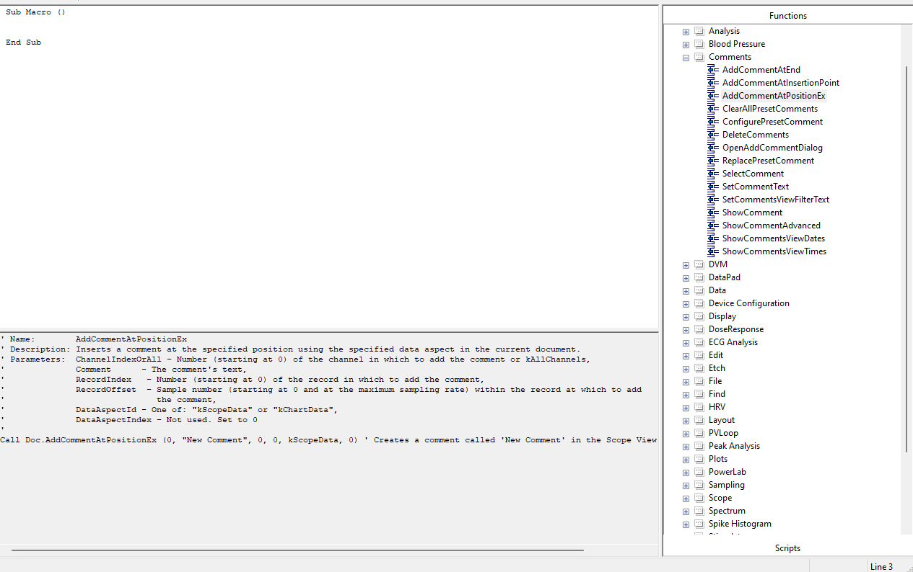

# LabChart 8: Python Template Scripts

[LabChart 8](https://adi.to/labchart)
is (//TODO: Generic sales pitch...) from
ADInstruments. This repository contains a number of templates that demonstrate
how to programmatically control the Labchart application using a Python script.

<!-- ---

The repository contains:
 + [`stimulator_scripts/`](./stimulator_scripts): Examples of how to use
   LabChart Lightning's scripting capabilities to output custom stimulus
   waveforms.
 + [`table_analyses/`](./table_analyses): Template scripts for various
   programming languages that show how to run statistical analyses on the
   summary data exported from LabChart Lightning. -->


## Automation using COM


Labchart provides an API that enables interaction with the application through a **Windows COM (Component Object Model)** interface. This interface can be accessed in a Python script using the `win32com.client` module from the `pywin32` library.

A simple example is shown below:

```python
import win32com.client

## Labchart must be open before running this script.

# Instantiate the labchart COM object.
labchart = win32com.client.Dispatch("ADIChart.Application") 

# Enter the path to your labchart file e.g "C:/Users/yourname/Documents/your_file.adicht"
filepath = "" 

# Open the specified document in Labchart   
document = labchart.Open(filepath)

# Add the comment "Hello World!" to the end of channel 1
channelIndex = 0 # Note: Labchart lanes are zero indexed. 
document.AddCommentAtEnd(channelIndex, "Hello World!")
```


The `document` object instantiated in the code example above exposes an interface to the opened document. A list of commands available on the interface can be found by running the `dir()` command:

```python
dir(doc)

['Activate', 'AddCommentAtSelection', 'AddRef', 'AddToDataPad', 'AppendComment', 'AppendFile', 'AppendFileEx', 'Application', 'Close', 'CreatePlot', 'FullName', 'GetChannelData', 'GetChannelName', 'GetDataPadColumnChannel', 'GetDataPadColumnFuncName', 'GetDataPadColumnUnit', 'GetDataPadCurrentValue', 'GetDataPadValue', 'GetDigitalInputBit', 'GetDigitalInputState', 'GetDigitalOutputBit', 'GetDigitalOutputState', 'GetIDsOfNames', 'GetName', 'GetPlot', 'GetPlotId', 'GetRecordLength', 'GetRecordSecsPerTick', 'GetRecordStartDate', 'GetScopeChannelData', 'GetSelectedData', 'GetSelectedValue', 'GetTypeInfo', 'GetTypeInfoCount', 'GetUnits', 'GetViewPos', 'ImportMacros', 'Invoke', 'IsChannelSelected', 'IsRecordMode', 'IsSampling', 'Macros', 'MatLabPutChannelData', 'MatLabPutFullMatrix', 'Name', 'NumberOfChannels', 'NumberOfDisplayedChannels', 'NumberOfRecords', 'PLCDebugCommand', 'Parent', 'Path', 'PlayMacro', 'PlayMessage', 'Print', 'QueryInterface', 'RecordTimeToTickPosition', 'Release', 'ResetSelection', 'SamplingRecord', ...]
```

Labcharts public COM interface was developed incrementally and therefore only a subset of the available commands are actually shown within the `dir()` print out.

A larger subset of commands can be discovered within the Labchart Macro feature shown in [Figure 1](#figure-1).


<a id="figure-1"></a>
<figure>
  
  <figcaption>Figure 1: The Labchart - Macro Editor window. Functions are listed in the right-hand column. Selecting a function displays extra information, such as a description and the required arguments. </figcaption>
</figure>


Certain functions, though not directly accessible through the COM interface in Python, can still be invoked if they appear in the LabChart Macro Editor or are identified using the Macro recording feature. For example, the `SetGuidelineValue` command:

```python
def invoke_com_method(com_object, method_name, *args):
    try:
        # Get the method dynamically
        method = getattr(com_object, method_name)
        # Call the method with arguments
        return method(*args)
    except AttributeError:
        print(f"Method '{method_name}' does not exist.")
    except Exception as e:
        print(f"Error invoking method '{method_name}': {e}")

# Run a command not directly available on the document com interface
invoke_com_method(document, "SetGuidelineValue", channelForGuideLine, 1, 0, "V", "")

```

A general tip for writing scripts is to first record a macro of the actions you wish to automate. The commands identified in the macro can then be copied across into your Python script. 

---
