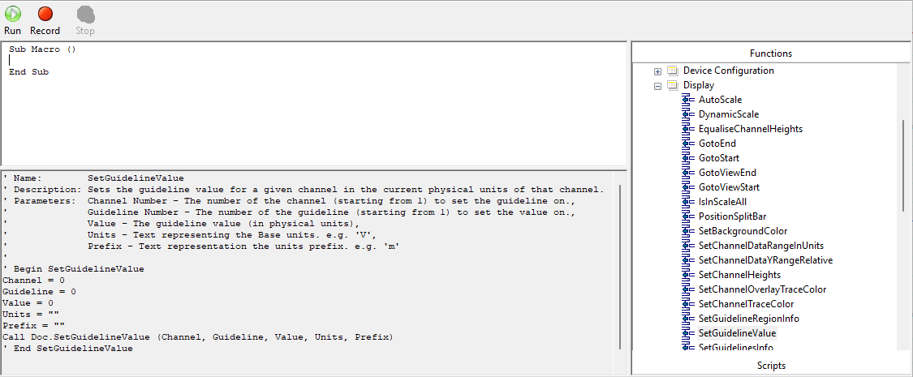

# LabChart 8 Scripts

[LabChart 8](https://adi.to/labchart)
is the gold-standard data aquisition and analysis application from
ADInstruments. This repository contains a number of templates that demonstrate
how to programmatically control the Labchart application using a number of languages including Python and VBScript.

---

The repository contains:

- [`example_scripts/`](./example_scripts): Examples of Labchart automation using Python and VBScript.

---

Upcoming changes

- MATLAB examples

## Automation using COM

Labchart provides an API that enables interaction with the application through a **Windows COM (Component Object Model)** interface. This interface can be accessed using win32 COM modules. E.g.in Python the `win32com.client` module from the `pywin32` library.

A simple Python example:

```python
import win32com.client

## Labchart must be open before running this script.

# Instantiate the labchart COM object.
labchart = win32com.client.Dispatch("ADIChart.Application")

# Get the active document
document = labchart.ActiveDocument

# Add the comment "Hello World!" to the end of channel 1
channelIndex = 0 # Note: Labchart channels are zero indexed.
document.AddCommentAtEnd(channelIndex, "Hello World!")
```

The `document` object instantiated in the code example above exposes an interface to the opened document. A list of commands available on the interface can be found by running the `dir()` command:

```python
dir(doc)

['Activate', 'AddCommentAtSelection', 'AddRef', 'AddToDataPad', 'AppendComment', 'AppendFile', 'AppendFileEx', 'Application', 'Close', 'CreatePlot', 'FullName', 'GetChannelData', 'GetChannelName', 'GetDataPadColumnChannel', 'GetDataPadColumnFuncName', 'GetDataPadColumnUnit', 'GetDataPadCurrentValue', 'GetDataPadValue', 'GetDigitalInputBit', 'GetDigitalInputState', 'GetDigitalOutputBit', 'GetDigitalOutputState', 'GetIDsOfNames', 'GetName', 'GetPlot', 'GetPlotId', 'GetRecordLength', 'GetRecordSecsPerTick', 'GetRecordStartDate', 'GetScopeChannelData', 'GetSelectedData', 'GetSelectedValue', 'GetTypeInfo', 'GetTypeInfoCount', 'GetUnits', 'GetViewPos', 'ImportMacros', 'Invoke', 'IsChannelSelected', 'IsRecordMode', 'IsSampling', 'Macros', 'MatLabPutChannelData', 'MatLabPutFullMatrix', 'Name', 'NumberOfChannels', 'NumberOfDisplayedChannels', 'NumberOfRecords', 'PLCDebugCommand', 'Parent', 'Path', 'PlayMacro', 'PlayMessage', 'Print', 'QueryInterface', 'RecordTimeToTickPosition', 'Release', 'ResetSelection', 'SamplingRecord', ...]
```

Labcharts public COM interface was developed incrementally and therefore only a subset of the available commands are actually shown within the `dir()` print out.

A larger subset of commands can be discovered within the Labchart Macro feature shown in [Figure 1](#figure-1).

<a id="figure-1"></a>

<figure>
  
  <figcaption>Figure 1: The Labchart - Macro Editor window. Functions are listed in the right-hand column. Selecting a function displays extra information, such as a description and the required arguments. </figcaption>
</figure>

Certain functions, though not directly accessible through the COM interface in Python, can still be invoked if they appear in the LabChart Macro Editor or are identified using the Macro recording feature. For example, the `SetGuidelineValue` command:

```python
def invoke_com_method(com_object, function_name, *args):
    """
    Invokes a method on a COM object by its name.

    Parameters:
        com_object: The COM object (created using win32com.client.Dispatch).
        function_name (str): The name of the method to invoke.
        *args: Arguments to pass to the method.

    Returns:
        The result of the method call, or None if the method fails.
    """
    try:
        # Get the DISPID (Dispatch ID) of the function by name
        dispid = com_object._oleobj_.GetIDsOfNames(0, function_name)

        # Invoke the function using the DISPID
        result = com_object._oleobj_.Invoke(
            dispid,  # DISPID of the function
            0,  # Reserved, must be 0
            win32com.client.pythoncom.DISPATCH_METHOD,  # Indicates a method call
            1,  # Indicates arguments are being passed
            *args  # Arguments to pass to the function
        )
        return result
    except pythoncom.com_error as e:
        print(f"Failed to invoke function '{function_name}': {e}")
        return None


# Run a command not directly available on the document com interface
invoke_com_method(document, "SetGuidelineValue", channelForGuideLine, 1, 0, "V", "")

```

A general tip for writing scripts is to first record a macro of the actions you wish to automate. The commands identified in the macro can then be copied across into your script.

---
